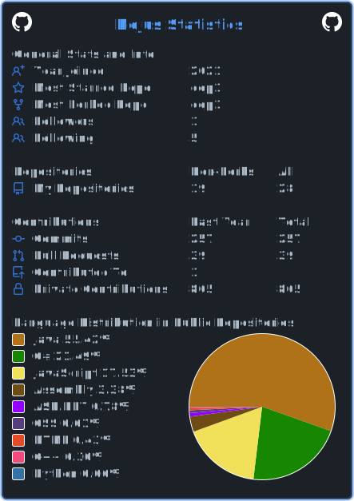

<!--START_SECTION:waka-->
<!--END_SECTION:waka-->
<!--  -->

 
   

 💻 **Operating systems:**  
-|

🛠️ **Languages:**
-|

🛠️ **Tools:**  
-|

🔗 **Links:**  
-|

 

<!--START_SECTION:waka-->
<!--END_SECTION:waka-->
<!--  -->
<!-- ===========================================================================================================================================OLD STYLE -->
<!-- 

 
   

 💻 **Operating systems:**  
 

🛠️ **Languages:**  

🛠️ **Tools:**  

🔗 **Links:**  

 
 -->
<!-- ===========================================================================================================================================OLD STYLE -->
<!--
----------------------
|

  | 

| ------------- | ------------- |
----------------------
**nojussta/nojussta** is a ✨ _special_ ✨ repository because its `README.md` (this file) appears on your GitHub profile.

Here are some ideas to get you started:
1

- 🔭 I’m currently working on ...
- 🌱 I’m currently learning ...
- 👯 I’m looking to collaborate on ...
- 🤔 I’m looking for help with ...
- 💬 Ask me about ...
- 📫 How to reach me: ...
- 😄 Pronouns: ...
- ⚡ Fun fact: ...
-->
